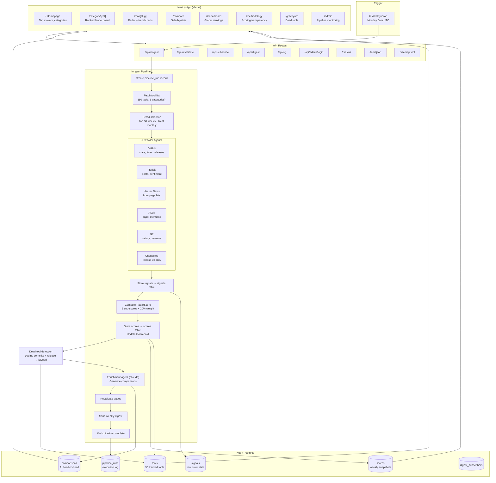
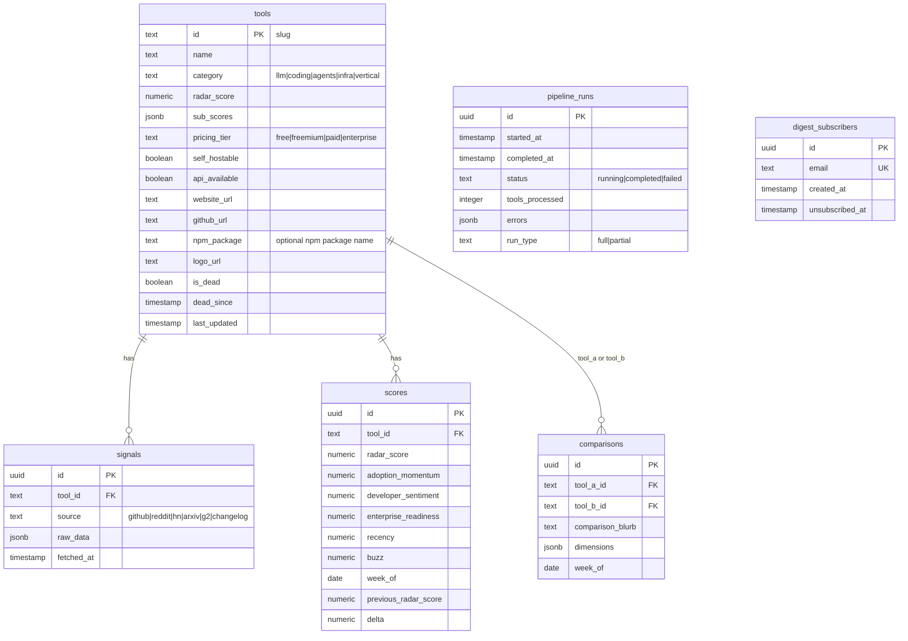

# AIRadar — Architecture

> High-level system architecture and data flow for the AIRadar platform.

---

## Tech Stack

| Layer | Technology |
|---|---|
| Framework | Next.js 16 (App Router, Turbopack) |
| Language | TypeScript 5 |
| UI | React 19, Tailwind CSS v4, Recharts |
| Database | Neon Serverless Postgres + Drizzle ORM |
| Orchestration | Inngest (event-driven, weekly cron) |
| AI/LLM | Claude via `@anthropic-ai/sdk` |
| Deployment | Vercel (serverless functions + edge) |
| Testing | Playwright (E2E), Vitest (unit) |
| Email | Resend (planned) |
| Validation | Zod |

---

## System Flow



---

## Directory Structure

```
src/
├── app/
│   ├── (public)/              # Public route group (force-dynamic)
│   │   ├── page.tsx           # Homepage — categories, top movers, leaderboard
│   │   ├── category/[category]/page.tsx
│   │   ├── tool/[slug]/page.tsx
│   │   ├── compare/page.tsx
│   │   ├── leaderboard/page.tsx
│   │   ├── methodology/page.tsx
│   │   ├── graveyard/page.tsx
│   │   └── layout.tsx         # Shared header + footer
│   ├── admin/
│   │   ├── page.tsx           # Pipeline monitoring dashboard (password-protected)
│   │   └── login/page.tsx     # Admin login form
│   ├── api/
│   │   ├── inngest/route.ts   # Inngest webhook
│   │   ├── revalidate/route.ts
│   │   ├── subscribe/route.ts
│   │   ├── digest/route.ts
│   │   ├── og/route.tsx       # Dynamic OG images
│   │   └── admin/login/route.ts  # Cookie-based admin auth
│   ├── layout.tsx             # Root layout (Inter font, metadata)
│   ├── globals.css            # Tailwind v4 imports
│   ├── robots.ts
│   ├── sitemap.ts
│   ├── rss.xml/route.ts
│   └── feed.json/route.ts     # JSON Feed 1.1
├── components/
│   ├── charts/                # RadarScoreChart, TrendChart (Recharts)
│   ├── layout/                # Header, Footer
│   └── ui/                    # ToolCard (with sparklines), ScoreBadge, DeltaBadge, SortControls
├── lib/
│   ├── agents/
│   │   ├── crawler/           # github.ts, reddit.ts, hn.ts, arxiv.ts, g2.ts, changelog.ts
│   │   └── enrichment/        # enrich-tool.ts (Claude comparisons)
│   ├── db/
│   │   ├── index.ts           # getDb() — Neon serverless + Drizzle
│   │   └── schema.ts          # 7 tables, enums, indexes
│   ├── digest/                # send-digest.ts
│   ├── inngest/
│   │   ├── client.ts          # Inngest({ id: "aidar" })
│   │   └── functions/         # weekly-pipeline.ts (9 steps)
│   ├── schemas/index.ts       # Zod types
│   └── scoring/
│       ├── compute-radar-score.ts
│       └── __tests__/
scripts/
├── seed-tools.ts              # Seed 50 tools into Neon (includes npmPackage)
├── set-npm-packages.ts        # One-time: populate npm_package on existing tools
└── run-migration.ts           # Run Drizzle migration
drizzle/
├── 0000_initial_schema.sql    # Initial DDL
└── 0001_add_npm_package.sql   # ALTER TABLE tools ADD COLUMN npm_package TEXT
src/
└── middleware.ts              # Admin route protection (cookie-based)
e2e/
└── critical-flows.spec.ts     # 34 Playwright tests
```

---

## Database Schema



---

## RadarScore Formula

Each tool receives a composite **RadarScore (0–100)** based on 5 equally-weighted sub-scores:

| Sub-score (20% each) | Signals |
|---|---|
| **Adoption Momentum** | GitHub stars velocity, npm downloads, G2 review growth |
| **Developer Sentiment** | Reddit/HN comment sentiment, G2 satisfaction |
| **Enterprise Readiness** | SOC2, SSO, self-host, pricing tier |
| **Recency** | Days since last release, commit frequency, changelog cadence |
| **Buzz** | HN front-page hits, Reddit post count, ArXiv mentions |

Scores are percentile-normalized across all tools. Missing signals redistribute weight to available sources.

---

## Pipeline Steps (weekly-pipeline.ts)

1. **Create pipeline run** — log start in `pipeline_runs`
2. **Fetch tools** — all 50 from `tools` table (includes `npmPackage`)
3. **Tiered selection** — top 50 by RadarScore weekly, rest monthly
4. **Crawl** — 6 adapters per tool (parallel, fail-continue); GitHub crawler also fetches npm weekly downloads from `api.npmjs.org` when `npmPackage` is set
5. **Store signals** — insert into `signals` table
6. **Score** — compute RadarScore + delta from previous week
7. **Dead tool detection** — flag tools with 0 commits + no release in 90+ days (`isDead=true`, `deadSince` set)
8. **Generate comparisons** — Claude enrichment for top tool pairs
9. **Revalidate** — trigger ISR page invalidation
10. **Send digest** — email to subscribers
11. **Finalize** — mark `pipeline_runs` complete with stats

---

## Key Design Decisions

| Decision | Choice | Rationale |
|---|---|---|
| Dynamic rendering | `force-dynamic` on all DB pages | `DATABASE_URL` not available at Vercel build time |
| DB connection | `@neondatabase/serverless` (HTTP) | No WebSocket needed, works in all serverless runtimes |
| Scoring weights | Equal 20% each (v0) | Iterate after validating rankings against known tools |
| Tiered updates | Top 50 weekly, rest monthly | Budget control — avoids 200+ LLM calls per run |
| Orchestration | Inngest | Event-driven, Vercel-native, built-in retries and fan-out |
| LLM provider | Claude (Anthropic) | Both crawling intelligence and enrichment generation |
| npm stats | `api.npmjs.org` (no auth) | Free download counts factored into adoption momentum |
| Admin auth | httpOnly cookie vs `ADMIN_PASSWORD` | Simple, no user DB needed; middleware protects all `/admin/*` |
| Dead tool detection | GitHub signal: 0 commits + no release in 90d | Avoids a separate scheduled job; runs at end of weekly pipeline |
| Feeds | RSS + JSON Feed 1.1 | Covers traditional RSS readers and modern feed clients |
